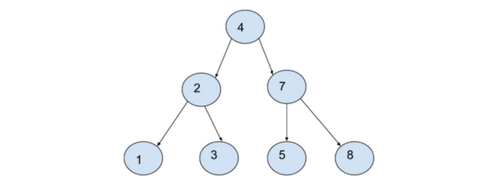
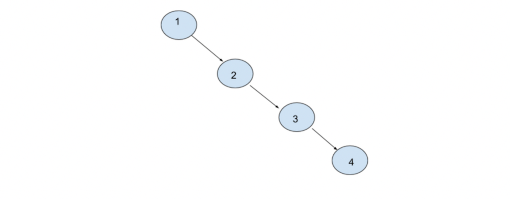
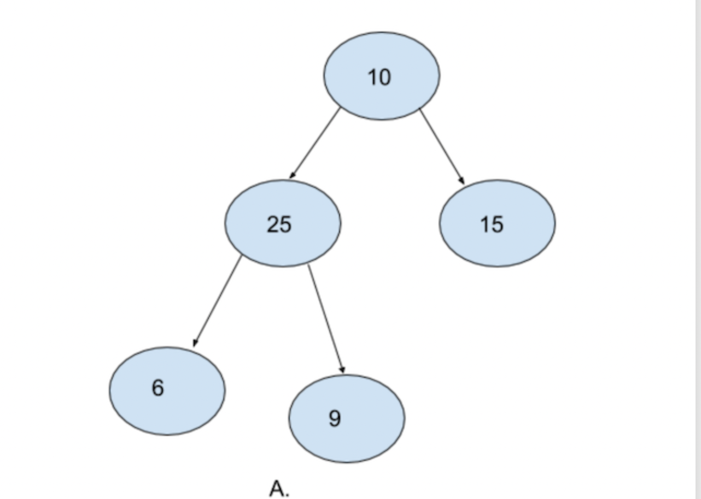
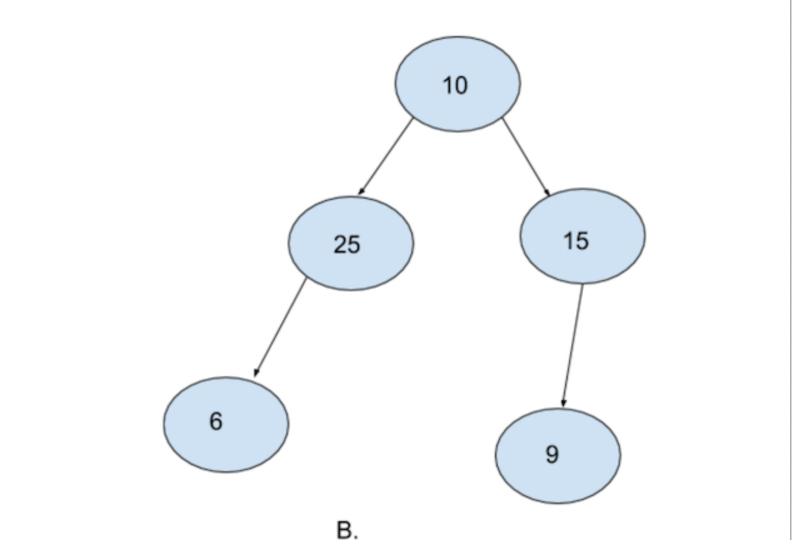
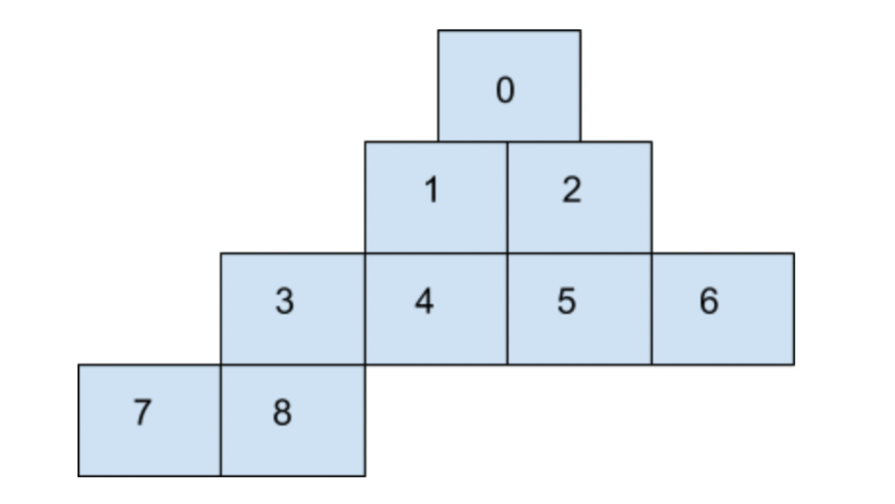
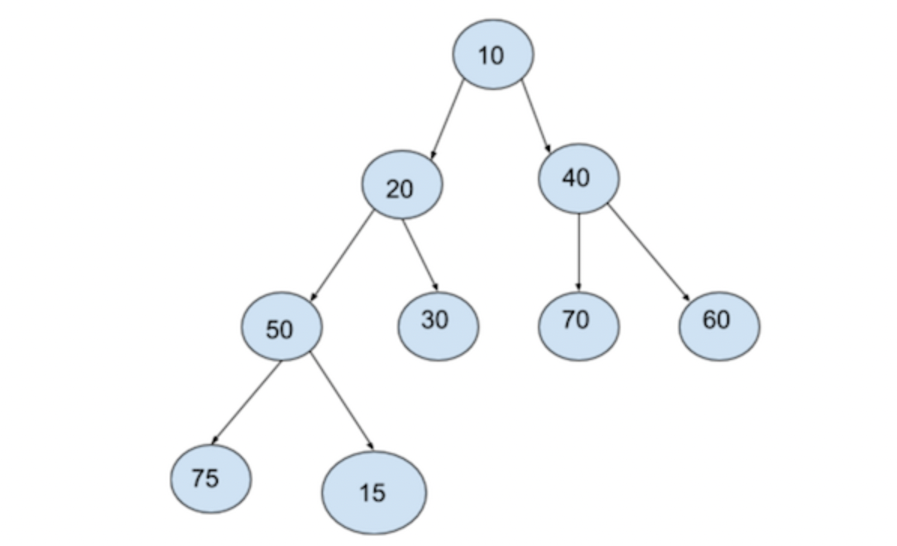
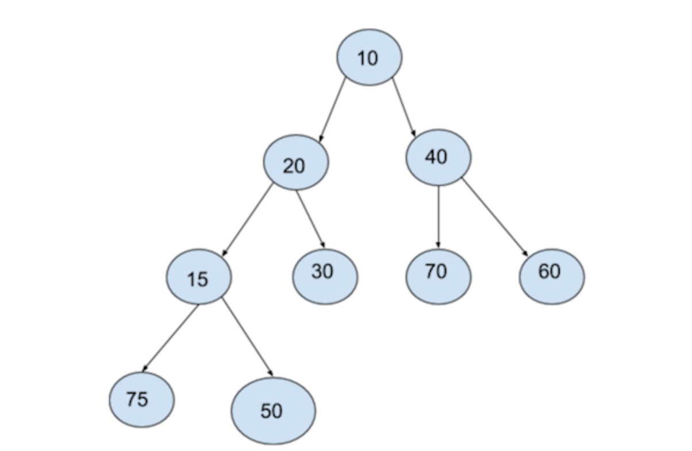

# Bubble Sort Introduction 

Bubble sort is an introductory sorting algorithm that iterates through a list and compares pairings of adjacent elements.

According to the sorting criteria, the algorithm swaps elements to shift elements towards the beginning or end of the list.

By default, a list is sorted if for any element e and position 1 through N:

e1 <= e2 <= e3 … eN, where N is the number of elements in the list.

For example, bubble sort transforms a list:
[5, 2, 9, 1, 5]

to an ascending order, from lowest to highest:
[1, 2, 5, 5, 9]

We implement the algorithm with two loops.

The first loop iterates as long as the list is unsorted and we assume it’s unsorted to start.

Within this loop, another iteration moves through the list. For each pairing, the algorithm asks:

In comparison, is the first element larger than the second element?

If it is, we swap the position of the elements. The larger element is now at a greater index than the smaller element.

When a swap is made, we know the list is still unsorted. The outer loop will run again when the inner loop concludes.

The process repeats until the largest element makes its way to the last index of the list. The outer loop runs until no swaps are made within the inner loop.

# Bubble Sort Sorting Algorithm 

The Bubble Sort algorithm is a simple algorithm to sort a list of N numbers in ascending order. Bubble sort works by iterating through a list and checking whether the current element is larger or smaller than the next element.

This algorithm consists of an outer iteration and an inner iteration. In the inner iteration, the first and second elements are first compared and swapped so that the second element has a higher value than the first. This is repeated for the subsequent second and third element pairs and so forth until the last pair of (N-2, N-1) elements is compared. At the end of the inner iteration, the largest element appears last. This is repeated for all elements of the list in the outer iteration.

# Bubble Sort Big-O Runtime
The Bubble Sort algorithm utilizes two loops: an outer loop to iterate over each element in the input list, and an inner loop to iterate, compare and exchange a pair of values in the list. The inner loop takes (N-1) iterations while the outer loop takes N iterations. Hence, the Big-O runtime for the algorithm is the product of O(N) and O(N-1), which is O(N^2).

# Bubble Sort Swapping Variables
The Bubble Sort algorithm requires swapping of variables in order to sort them. The swapping algorithm is dependent on the programming language. For most languages, a temporary variable is needed to hold one of the values being swapped:

temp_variable = number_1
number_1 = number_2
number_2 = temp_variable
For others, the swapping can be done in a single assignment:

number_1, number_2 = number_2, number_1

# Quick Sort

Quicksort is a method for sorting an array by repeatedly partitioning it into sub-arrays by:

Selecting an element from the current array. This element is called the pivot element, and in our implementation we used the mid element.
Comparing every element in the array to the pivot element, swap the elements into sides greater than and less than. The partition point in the array is where we guarantee everything before is less and everything after is greater than.
Repeating this process on the sub-arrays separated by the partition point. Do this until a sub-array contains a single element. When the partitioning and swapping are done, the arrays are sorted from smallest to largest.
The worst case runtime for quicksort is O(N^2) and the average runtime for quicksort is O(N logN). The worst case runtime is so unusual that the quicksort algorithm is typically referred to as O(N logN)“

# Heap and Heap Sort   

Heaps are used to maintain a maximum or minimum value in a dataset. In this article, we'll learn about the structure of a max-heap as well as how elements can be added to a max-heap

# Introduction to Heaps

Imagine you have a demanding boss (hopefully this is theoretical!). They always want the most important thing done. Of course, once you finish the most important task, another ont takes its place.

You can manage this problem using a priority queue to ensure you're always working on the most pressing assigment and heaps are commonly used to create a priority queue. 

Heaps that track the maximum value in a dataset are max-heaps while heaps that track the minimum value are referred to as min-heaps. We will focus on max-heaps in this article, but the approach for a min-heap are nearly identical. 

Think of the max-heap as a binary tree with two qualities:

1. The root is the maximum value for the dataset
2. Every parent's value is greater thean its children. 

These two properties are the defining characteristics of the max-heap. By maintaing these two properties, we can efficently retrieve and update the maximum value. 

# Heap Representations

We can picture max-heaps as binary trees, where each node has at most two children. As we add elements to the heap, they're added from left to right until we've filled the entire level. 

> Note: The examples in this article use numbers since this is a straightforward value, but heaps have many practical applications. 

At the top, we have our root value, 11. Then, we've filled the next level containing the root value's children 10 and 9. The next addition will be added as the left child of 10 starting a new level in the tree. We would continue filling the level from left to right until 9 had its right child filled. 

Conceptually, the tree representation is benefical for understanding. Practically, we implement heaps in a sequential data structure like an array or list for efficency. 

Notice how by filling the tree from left to right; we're leaving no gaps in the array. The location of each child or parent derives from a formula using the index. 

1. left child (index*2) +1 
2. right child (index *2) +2 
3. parent (index-1) /2 not used on the root! 

# Adding an Element 

Sometimes you will add an element to the heap that violates the heap's essential properties. 

We're adding 18 as a left child of 2, which violates the max-heap property that parents must be larger or equal to their children. 

We need to restore the fundamental heap properties. This restoration is known as heapify of heapifying. We're adding an element to the bottom of the tree and moving upwards, so we're heapifying up. 

As long as we've violated the heap properties, we'll swap the offending child with its parent until we restore the properties, or until there's no parent left. If there is no parent left, that elemet becomes the new root of the tree. 

18 swaps with 2, but there's still work to do because now 18 is a child of 11. One more swap and we've restored the heap properties. The child values, 18 is lesser than the parent and root of the tree, 20. We can sere that 18's children  11 and 10 are also smaller than their parent. 

# Review 
Nice job reaching the end of this article. Let’s review what we learned:

1. A max-heap tracks the maximum element as the element within a data set.
2. Max-heaps must maintain the heap property that the parent values must be greater than their children.
3. When adding elements, we use .heapify_up() to compare the new element with its parent; if it violates the heap property, then we must swap the two values.

# Priority Queue Intuition 

Consider the following scenario -

A doctor is working in an emergency wing at a hospital. When patients come in, a nurse checks their symptoms and based on the severity of the illness, sends them to the doctor. For e.g. a guy who has had an accident is sent before someone who has come with a runny nose. But there is a slight problem. There is only one nurse and only one doctor. In the amount of time nurse takes to check the symptoms, the doctor has to work alone with the patients, hurting their overall productivity.

You are a ninja programmer. The doctor comes to you for help. Your job is to write a small software in which patients will enter their symptoms and will receive a priority number based on their illness. The doctor has given you a list of common ailments, and the priority in which he would prefer seeing them. How would you solve the priority problem?

# Priority Queues 

Like the name suggests, a priority queue is similar to a regular queue, except that each element in the queue has a priority associated with it. A regular queue is a FIFO data structure, meaning that the first element to be added to the queue is also the first to be removed.

With a priority queue, this order of removal is instead based on the priority. Depending on how we choose to set up the priority queue, we either remove the element with the most priority, or an element of the least priority.

For the sake of discussion, let's focus on removing the element of least priority for now.

# Functionality
If we were to create a PriorityQueue class, what methods would it need to have?

Here are the two key methods:

insert - insert an element
remove - remove an element
And we can also add the same utility methods that we had in our regular Queue class:

front - returns the element at the front of the queue
size - returns the number of elements present in the queue
is_empty - returns True if there are no elements in the queue, and False otherwise
As part of this functionality, we will need a way of assigning priorities to the items.

A very common way to solve the patient-doctor problem mentioned above would be to assign each ailment a priority. For e.g.

* A running nose may be assigned priority 1
* Fever may be assigned 2
* Accident may get a priority 10
You will find this theme recurring in all of programming. We use numbers to effectively represent data.

For the sake of simplicity, let's only consider integers here. Let us assume a scenario where we get integers as input and we assign a priority on how large / small they are. Let us say the smaller the number, the smaller its priority. So, in our simplified version of the problem statement the value of the integer serves as a priority.

Our goal is to create a queue where the element with the lowest priority is removed first. Therefore, the remove method will remove the smallest number from the priority queue. Thus, the largest number will be the last to be removed from the priority queue and the smallest number will be the first to be removed.

# How should we implement it?
What we've described above is just the abstract characteristics that we expect from this data structure. As with stacks and queues (and other abstract data types), there is more than one way that we could implement our priority queue such that it would exhibit the above behaviors.

However, not all implementations are ideal. When we implemented a regular queue earlier, you may remember the enqueue and dequeue methods had a time complexity of  𝑂(1) . Similarly, we would like the insert and remove methods on our priority queue to be fast.

So, what underlying structure should we use to implement the priority queue such that it will be as efficient as possible? Let's look at some different structures and consider the pros and cons.

# Arrays
Earlier, we saw that one way to implement a queue was by using an array. We could do a similar thing for priority queues. We could use the array to store our data.

Insertion in an array is very fast. Unless the array is full, we can do it in O(1) time.

Note: When the array is full, we will simply create a new array and copy all the elements from our old array to new array. It's exactly similar to what we do for our queue's implementation using arrays.

What about removal? We always want to remove the smallest or highest priority data from the array, depending on if this is a max-heap or min-heap. In the worst case, we will have to search the entire array, which will take O(n) time. Thus, to remove the element, the time complexity would be O(n).

This also creates an additional problem for us. The index from which we removed the element is now empty. We cannot leave empty indices in our array. Over the course of operations, we will be wasting a lot of space if we did that.

Therefore, insertion no longer happens in O(1) time. Rather, every time we insert, we will have to look for these empty indices and put our new element in the first empty index we find. In the worst case, this also takes O(n) time. Therefore, our time complexity with arrays (for both insertion and removal) would be O(n).

# LinkedList
Insertion is very easy in a linked list. If we maintain a variable to keep track of the tail of the linked list, then we can simply add a new node at this location. Thus, insertion takes O(1) time.

For removal, we will have to traverse the entire list and find the smallest element, which will require O(n) time.

Note that with linked lists, unlike arrays, we do not have to worry about empty indices.

A linked linked certainly seems to be a better option than an array. Although they have the same time complexity for removal, the time complexity for insertion is better.

# HashMap
The same problem lies in HashMap as well. We can insert in O(1) time. Although, we can remove an element from a HashMap in O(1) time but we have to first search for the smallest element in the map. This will again take O(n) time. Therefore, the time complexity of remove is O(n) for hashmaps.

# Binary Search Trees
Binary Search Trees are laid out according to the value of the node that we want to insert. All elements greater than the root go to the right of the root, and all elements smaller than the root go to the left of the root.

If we assume that our Binary Search tree is balanced, insertion would require O(h) time in the worst case. Similarly, removal would also require O(h) time. Here h is the height of the binary search tree.

 

A Binary Tree is called a Balanced Binary Tree when the difference between the heights of it's left subtree and right subtree do not differ by more than one. Additionally, to be balanced, all the subtrees of the binary tree must also be balanced.

For a balanced tree, we can safely approximate the height of the tree h to log(n). Thus, both insertion and removal require O(log(n)) time in a binary search tree.

However, in the worst case, our binary search tree might just be a sequential list of nodes (stretching to the right or to the left). Consider the following tree:

However, in the worst case, our binary search tree might just be a sequential list of nodes (stretching to the right or to the left). Consider the following tree:

In such a scenario the binary search tree effectively turns into a linked list. In this case, the time complexity would be O(n)

To avoid this situation, we would need a self-balancing tree which incure additional complexity.

We could use any of the above data structures to implement our priority queue—and they would work, in the sense that they would exhibit the outward behavior we expect in a priority queue.

However, none of them acheived our goal of having  𝑂(1)  time complexity for both insert and remove. To do that, we will need to explore something new: A heap.

# Heaps 

A Heap is a data structure with the following two main properties:

1. Complete Binary Tree
2. Heap Order Property

1. Complete Binary Tree - Like the name suggests we use a binary tree to create heaps. A complete binary tree is a special type of binary tree in which all levels must be filled except for the last level. Moreover, in the last leve, the elements must be filled from left to right. 

 

A. is a complete binary tree. Notice how every level except the last level is filled. Also notice how the last level is filled from left to right.

 

B. is not a complete binary tree. Although evey level is filled except for the last level. Notice how the last level is not filled from left to right. 25 does not have any right node and yet there is one more node (9) in the same level towards the right of it. It is mandatory for a complete binary tree to be filled from left to right.

## Heap Order Property - Heaps come in two falvors 

* Min Heap 
* Max Heap

Min Heap - In the case of min heaps, for each node, the parent node must be samaller than both the childs. It's okay if one or both of the child nodes do not exists. However if they do exist, the value of the parent node must be smaller. Also note that it doesn't matter if the left node is greater than the right node or vice versa. The only important condition is that the root node must be smaller than both its child nodes. 

Max Heap - For max heaps, this condition is exactly reversed. For each node, the value of the parent node must be larger than both the child nodes. 

Thus, for a data structure to be called a Heap, it must satisfy both of the above properties. 

1. It must be a complete binary tree 
2. It must satisfy the heap order properly. If it's a min heap, it must satisfy the heap order property for min heaps. If its'a  max heap, it should satisfy the heap order property for the max heap.   

# Heaps for Priority Queues
Let's take a step back and reflect on what we have done.

We have examined popular data structures and observed their time complexities.
We have looked at a new data structure called Heap
We know that Heaps have two properties -
 i. CBT 
 ii. Heap Order Property
We have looked at what CBT is and what Heap Order Property is
By now, it must have been clear to you that we are going to use Heaps to create our Priority Queues. But are you convinced that heaps are a good structure to create Priority Queues?

Ans.

Other than Binary Search trees, all other popular data structures seemed to have a time complexity of O(n) for both insertion and removal.

Binary Search Trees seemed like an effective data structure with average case time complexity of O(log(n) (or O(h)) for both the operations. However, in the worst case, a Binary Search Tree may not be balanced and instead behave like a linked list. In such a case, the time complexity in terms of height would still be O(h) but because the height of the binary search tree will be equal to the number of elements in the tree, the actual time complexity in terms of number of elements n would be O(n).

The CBT property of Heaps ensures that the tree is always balanced. Therefore, the height h of the tree will always be equal to log(n).

The Heap Order Property ensures that there is some definite structure to our Complete Binary Tree with respect to the value of the elements. In case of a min-heap, the minimum element will always lie at the root node. Similarly, in case of a maxp-heap, the maximum element will always lie at the root node. In both the cases, every time we insert or remove an element, the time complexity remains O(log(n)).

Therefore, because of the time complexity being O(log(n)), we prefer heaps over other popular data structures to create our Priority Queues.

# Complete Binary Trees using Arrays 

Although we call them complete binary trees, and we will always visualize them as binary trees, we never use binary trees to create them. Instead, we actually use arrays to create our complete binary trees.

Lets' us see how  

0,1,2,3,4,5,6,7,8

An array is a contigous block of memory with individual "blocks" are laid out one after the other in memory. We are used to visualizing arrays as sequential blocks of memory. 

However, if we visualize them in the following way, we can find some similarities between arrays and complete binary trees ? 

Let's think about it.

> In a complete binary tree, it is mandatory for all levels before the last level to be completely filled.
If we visualize our array in this manner, do we satisfy this property of a CBT? All we have to ensure is that we put elements in array indices sequenially i.e. the smaller index first and the larger index next. If we do that, we can be assured that all levels before the last level will be completely filled.

In a CBT, if the last level is not completely filled, the nodes must be filled from left to right.
Again, if we put elements in the array indices sequentially, from smaller index to larger index, we can be assured that if the last level is not filled, it will certainly be filled from left to right.

Thus we can use an array to create our Completer Binary Tree. Although it's an array, we will always visualize it as complete binary tree when talking about heaps.

Now let's talk about insert and remove operation in a heap. We will create our heap class which with these two operations. We also add a few utility methods for our convenience. Finally, because we know we are going to use arrays to create our heaps, we will also initialize an array.

Note that we are creating min heaps for now. The max heap will follow the exact some process. The only difference arises in the Heap Order Property.

As always we will use Python lists like C-style arrays to make the implementation as language agnostic as possible.

# Insert 

Insertion operation in a CBT is quite simple. Because we are using arrays to implement a CBT, we will always insert at the `next_index`. Also, after inserting, we will increment the value of `next_index`.

However, this isn't enough. We also have to maintain the heap order property. We know that for min-heaps, the parent node is supposed to be smaller than both the child nodes. 

Counting indices, we know that our next element should go at index 8. Let's say we want to insert 15 as our next element in the heap. In that case, we start off by inserting 15 at index 8.

Remember, although we are using arrays to implement a CBT, we will always visualize it as a binary tree. We will only consider them as arrays while implementing them.

So, we went ahead and insert 15 at index 8. But this violates our heap order property. We are considering min-heap and the parent node of 15 is larger.

In such a case, we heapify. We consider the parent node of the node we inserted and compare their values. In case of min-heaps, if the parent node is larger than the child node (the one we just inserted), we swap the nodes.

Now the complete binary tree looks something like

Is the problem solved?

Swapping the nodes for 15 and 50 certainly solved our problem. But it also introduced a new problem. Notice 15 and 20. We are again in the same spot. The parent node is larger than the child node. And in a min-heap we cannot allow that. So, what do we do? We heapify. We swap these two nodes just as we swapped our previous two nodes.

Does everything seem fine now?

We only have to consider the nodes that we swapped. And looks like we are fine.

Now let's take a step back and see what we did.

We first inserted our element at the possible index.

Then we compared this element with the parent element and swapped them after finding that our child node was smaller than our parent node. And we did this process again. While writing code, we will continue this process until we find a parent which is smaller than the child node. Because we are travering the tree upwards while heapifying, this particular process is more accurately called up-heapify.

Thus our insert method is actually done in two steps:

insert
up-heapify

# Time Complexity

Before talking about the implementation of `insert`, let's talk about the time complexity of the `insert` method. 

* Putting an element at a particular index in an array takes `O(1)` time. 
* However, in case of heapify, in the worst case we may have to travel from the node that we inserted right to the root node (placed at 0th index in the array). This would take `O(h)` time. In other words, this would be an `O(log(n))` operation. 

Thus the time complexity of `insert` would be `O(log(n))`.

[Final Heap] (./heap.py)