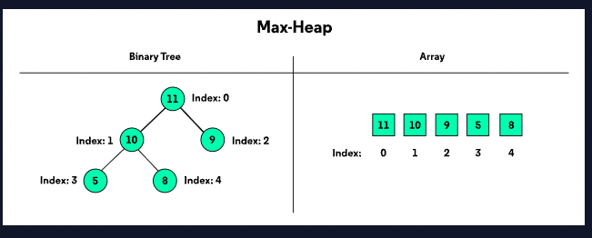
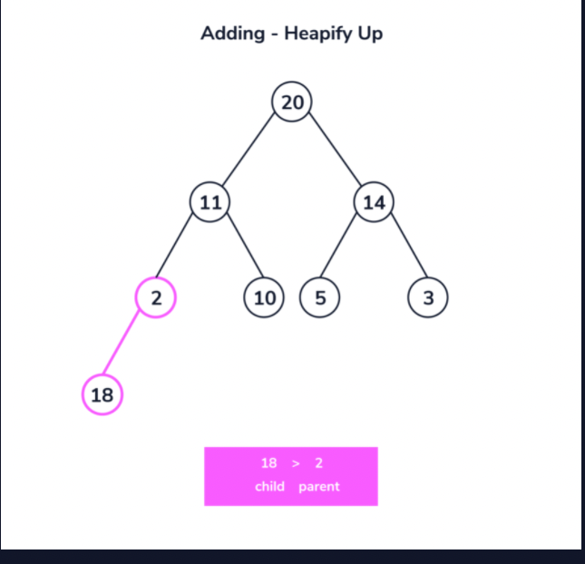

# Bubble Sort Introduction 

Bubble sort is an introductory sorting algorithm that iterates through a list and compares pairings of adjacent elements.

According to the sorting criteria, the algorithm swaps elements to shift elements towards the beginning or end of the list.

By default, a list is sorted if for any element e and position 1 through N:

e1 <= e2 <= e3 … eN, where N is the number of elements in the list.

For example, bubble sort transforms a list:
[5, 2, 9, 1, 5]

to an ascending order, from lowest to highest:
[1, 2, 5, 5, 9]

We implement the algorithm with two loops.

The first loop iterates as long as the list is unsorted and we assume it’s unsorted to start.

Within this loop, another iteration moves through the list. For each pairing, the algorithm asks:

In comparison, is the first element larger than the second element?

If it is, we swap the position of the elements. The larger element is now at a greater index than the smaller element.

When a swap is made, we know the list is still unsorted. The outer loop will run again when the inner loop concludes.

The process repeats until the largest element makes its way to the last index of the list. The outer loop runs until no swaps are made within the inner loop.

# Bubble Sort Sorting Algorithm 

The Bubble Sort algorithm is a simple algorithm to sort a list of N numbers in ascending order. Bubble sort works by iterating through a list and checking whether the current element is larger or smaller than the next element.

This algorithm consists of an outer iteration and an inner iteration. In the inner iteration, the first and second elements are first compared and swapped so that the second element has a higher value than the first. This is repeated for the subsequent second and third element pairs and so forth until the last pair of (N-2, N-1) elements is compared. At the end of the inner iteration, the largest element appears last. This is repeated for all elements of the list in the outer iteration.

# Bubble Sort Big-O Runtime
The Bubble Sort algorithm utilizes two loops: an outer loop to iterate over each element in the input list, and an inner loop to iterate, compare and exchange a pair of values in the list. The inner loop takes (N-1) iterations while the outer loop takes N iterations. Hence, the Big-O runtime for the algorithm is the product of O(N) and O(N-1), which is O(N^2).

# Bubble Sort Swapping Variables
The Bubble Sort algorithm requires swapping of variables in order to sort them. The swapping algorithm is dependent on the programming language. For most languages, a temporary variable is needed to hold one of the values being swapped:

temp_variable = number_1
number_1 = number_2
number_2 = temp_variable
For others, the swapping can be done in a single assignment:

number_1, number_2 = number_2, number_1

# Quick Sort

Quicksort is a method for sorting an array by repeatedly partitioning it into sub-arrays by:

Selecting an element from the current array. This element is called the pivot element, and in our implementation we used the mid element.
Comparing every element in the array to the pivot element, swap the elements into sides greater than and less than. The partition point in the array is where we guarantee everything before is less and everything after is greater than.
Repeating this process on the sub-arrays separated by the partition point. Do this until a sub-array contains a single element. When the partitioning and swapping are done, the arrays are sorted from smallest to largest.
The worst case runtime for quicksort is O(N^2) and the average runtime for quicksort is O(N logN). The worst case runtime is so unusual that the quicksort algorithm is typically referred to as O(N logN)“

# Heap and Heap Sort   

Heaps are used to maintain a maximum or minimum value in a dataset. In this article, we'll learn about the structure of a max-heap as well as how elements can be added to a max-heap

# Introduction to Heaps

Imagine you have a demanding boss (hopefully this is theoretical!). They always want the most important thing done. Of course, once you finish the most important task, another ont takes its place.

You can manage this problem using a priority queue to ensure you're always working on the most pressing assigment and heaps are commonly used to create a priority queue. 

Heaps that track the maximum value in a dataset are max-heaps while heaps that track the minimum value are referred to as min-heaps. We will focus on max-heaps in this article, but the approach for a min-heap are nearly identical. 

Think of the max-heap as a binary tree with two qualities:

1. The root is the maximum value for the dataset
2. Every parent's value is greater thean its children. 

These two properties are the defining characteristics of the max-heap. By maintaing these two properties, we can efficently retrieve and update the maximum value. 

# Heap Representations

We can picture max-heaps as binary trees, where each node has at most two children. As we add elements to the heap, they're added from left to right until we've filled the entire level. 

> Note: The examples in this article use numbers since this is a straightforward value, but heaps have many practical applications. 

At the top, we have our root value, 11. Then, we've filled the next level containing the root value's children 10 and 9. The next addition will be added as the left child of 10 starting a new level in the tree. We would continue filling the level from left to right until 9 had its right child filled. 

Conceptually, the tree representation is benefical for understanding. Practically, we implement heaps in a sequential data structure like an array or list for efficency. 

Notice how by filling the tree from left to right; we're leaving no gaps in the array. The location of each child or parent derives from a formula using the index. 

1. left child (index*2) +1 
2. right child (index *2) +2 
3. parent (index-1) /2 not used on the root! 

# Adding an Element 

Sometimes you will add an element to the heap that violates the heap's essential properties. 

We're adding 18 as a left child of 2, which violates the max-heap property that parents must be larger or equal to their children. 

We need to restore the fundamental heap properties. This restoration is known as heapify of heapifying. We're adding an element to the bottom of the tree and moving upwards, so we're heapifying up. 

As long as we've violated the heap properties, we'll swap the offending child with its parent until we restore the properties, or until there's no parent left. If there is no parent left, that elemet becomes the new root of the tree. 

18 swaps with 2, but there's still work to do because now 18 is a child of 11. One more swap and we've restored the heap properties. The child values, 18 is lesser than the parent and root of the tree, 20. We can sere that 18's children  11 and 10 are also smaller than their parent. 

# Review 
Nice job reaching the end of this article. Let’s review what we learned:

1. A max-heap tracks the maximum element as the element within a data set.
2. Max-heaps must maintain the heap property that the parent values must be greater than their children.
3. When adding elements, we use .heapify_up() to compare the new element with its parent; if it violates the heap property, then we must swap the two values.

